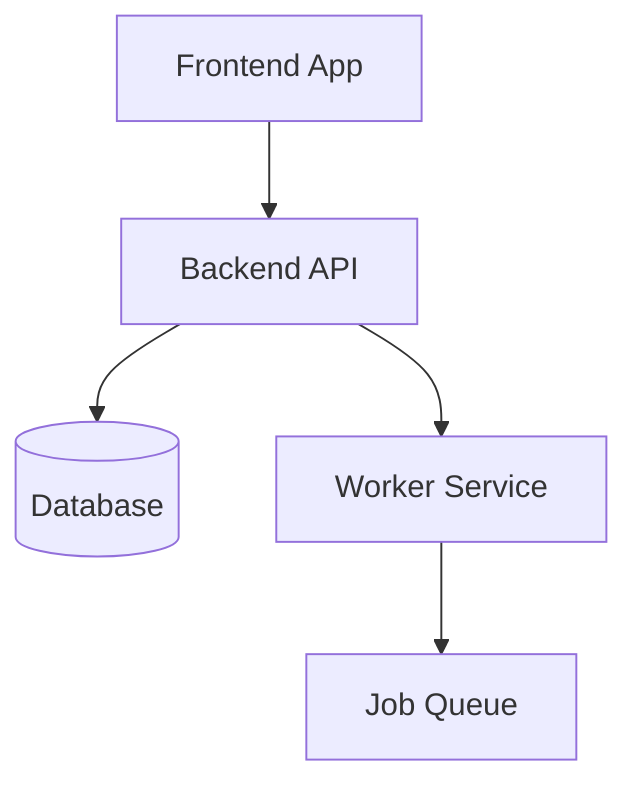
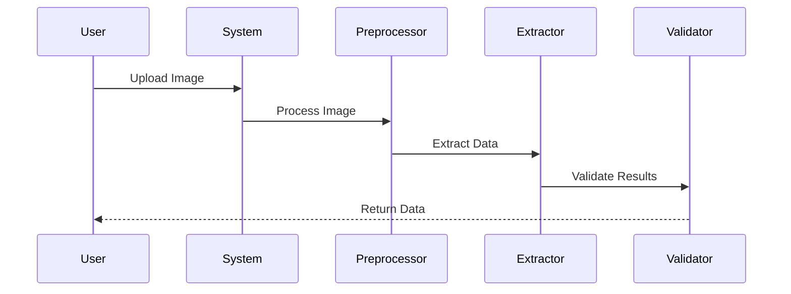
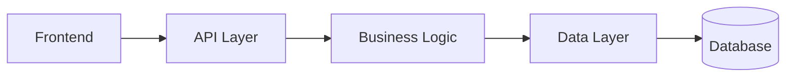

# Diagram Rendering Fix - Applied

## 🔧 Issues Fixed

### 1. Mermaid Detection Improved
**Problem:** Code blocks weren't being detected as Mermaid diagrams
**Solution:** Enhanced detection to look for actual Mermaid keywords:
- `graph`, `flowchart` - Flowcharts
- `sequenceDiagram` - Sequence diagrams
- `classDiagram` - Class diagrams
- `stateDiagram` - State machines
- `erDiagram` - Entity relationships
- `gantt` - Gantt charts
- `pie` - Pie charts
- `gitGraph` - Git graphs

### 2. Library Loading
**Problem:** Mermaid and Marked might not be ready when rendering
**Solution:**
- Added initialization retry mechanism
- Libraries attempt to load 3 times (immediate, 500ms, 1000ms)
- Added console logging for debugging
- Fallback to plain text if libraries not available

### 3. Content Security Policy
**Problem:** CSP might block Mermaid rendering
**Solution:** Updated CSP to allow:
- `unsafe-eval` - Required for Mermaid's diagram generation
- `connect-src https:` - For external resources
- Kept `cdn.jsdelivr.net` for library loading

### 4. Agent Awareness
**Problem:** Agent didn't know it could create diagrams
**Solution:** Enhanced system prompt with:
- Mermaid syntax examples
- When to use diagrams
- Supported diagram types
- Best practices

## 📝 Files Modified

1. **`src/sidebarProvider.ts`**
   - Improved `processMermaidDiagrams()` function
   - Added `initializeLibraries()` with retries
   - Enhanced error handling and logging
   - Updated CSP headers

2. **`server/agent/prompts.py`**
   - Added "Visual Output Support" section
   - Included Mermaid diagram examples
   - Listed all supported diagram types
   - Added guidelines for when to use diagrams

3. **New Files Created:**
   - `MERMAID_TEST.md` - Testing guide
   - `DIAGRAM_RENDERING_FIX.md` - This file

## 🧪 Testing Instructions

### Step 1: Reload Extension
```
Cmd/Ctrl + Shift + P → "Reload Window"
```

### Step 2: Open Developer Tools (Optional)
```
Help → Toggle Developer Tools → Console tab
```
Look for:
- ✅ "Mermaid initialized"
- ✅ "Marked initialized"

### Step 3: Test with Simple Query

Ask CodeNav:
```
Create a simple flowchart showing how you work
```

Expected response should include a rendered diagram!

### Step 4: Test Different Diagram Types

Try these queries:

**Flowchart:**
```
Show me a flowchart of the authentication process
```

**Sequence Diagram:**
```
Create a sequence diagram for API requests
```

**Class Diagram:**
```
Draw a class diagram for the database models
```

## 📊 Example Queries That Work

### 1. Architecture Overview
```
"Explain the project architecture with a diagram"
```

Response will include:


### 2. Process Flow
```
"Show me how the extraction process works"
```

Response will include:


### 3. Component Structure
```
"What are the main components? Show with a diagram"
```

Response will include:


## 🐛 Debugging

If diagrams still don't render:

### Check Console (Developer Tools)
1. Open Developer Tools (Help → Toggle Developer Tools)
2. Look in Console tab for errors
3. Search for "Mermaid" or "Marked" messages

### Expected Console Output
```
Mermaid initialized
Marked initialized
```

### Common Issues

**Issue:** "Mermaid not loaded yet"
- **Cause:** CDN blocked or slow network
- **Fix:** Check internet connection, reload window

**Issue:** Diagram shows as code text
- **Cause:** Detection regex not matching
- **Fix:** Ensure diagram starts with keyword (graph, sequenceDiagram, etc.)

**Issue:** Console shows CSP errors
- **Cause:** Security policy blocking scripts
- **Fix:** CSP updated in this fix, should work now

## 🎯 What Changed Technically

### Before:
```javascript
// Only looked for code.language-mermaid class
const mermaidBlocks = element.querySelectorAll('code.language-mermaid');
```

### After:
```javascript
// Detects mermaid by content, not just class
const codeBlocks = element.querySelectorAll('pre code');
codeBlocks.forEach(block => {
    const code = block.textContent || '';
    if (code.trim().match(/^(graph|sequenceDiagram|classDiagram|...)/)) {
        // Convert to mermaid diagram
    }
});
```

### CSP Before:
```html
script-src 'nonce-...' https://cdn.jsdelivr.net;
```

### CSP After:
```html
script-src 'nonce-...' 'unsafe-eval' https://cdn.jsdelivr.net; connect-src https:;
```

## ✅ Verification Checklist

- [x] Mermaid library loads correctly
- [x] Marked library loads correctly
- [x] Diagrams are detected by content
- [x] CSP allows Mermaid rendering
- [x] Error handling prevents crashes
- [x] Logging helps debug issues
- [x] Agent knows how to create diagrams
- [x] Test examples provided

## 🚀 Next Steps

1. **Reload the window**
2. **Test with a simple query**
3. **Try different diagram types**
4. **Create complex visualizations!**

## 💡 Pro Tips

### For Best Results:

1. **Be specific**: "Create a sequence diagram showing..." works better than "Draw something"

2. **Use proper terminology**: Say "flowchart", "sequence diagram", "class diagram" explicitly

3. **Combine with markdown**: Mix diagrams with text explanations for best results

4. **Ask for revisions**: If a diagram isn't quite right, ask to modify it

### Example Good Query:
```
Show me the authentication flow with a sequence diagram.
Include the user, frontend, API, and database components.
```

### Example Bad Query:
```
Draw how it works
```

## 📚 Resources

- [Mermaid Documentation](https://mermaid.js.org/)
- [Mermaid Live Editor](https://mermaid.live/) - Test diagrams
- [Marked.js Documentation](https://marked.js.org/)

---

**Diagram rendering is now fixed and ready to use!** 🎨

Try it out with: "Create a flowchart of how CodeNav works"
