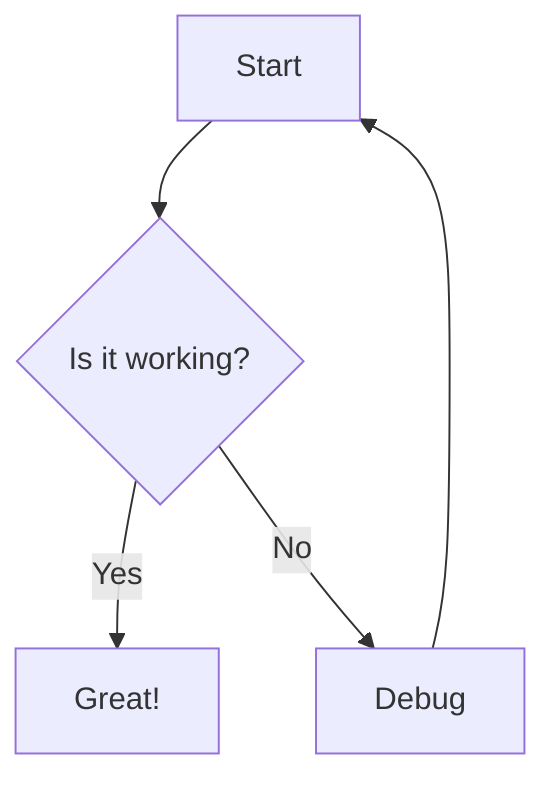
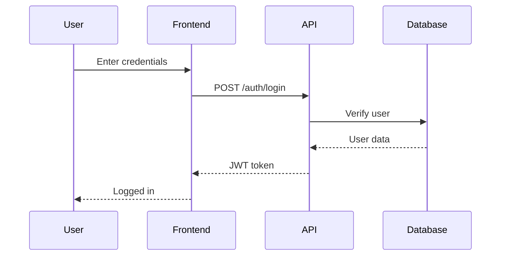

# Enhanced UI Features - CodeNav

## Overview

CodeNav now supports **advanced rendering capabilities** including markdown, Mermaid diagrams, file edit tracking, and live thinking display!

## ✅ Features Implemented

### 1. Markdown Rendering

The agent's responses now support full GitHub-Flavored Markdown (GFM):

**Supported Elements:**
- **Headings** (`#`, `##`, `###`, etc.)
- **Code blocks** with syntax highlighting
- **Inline code** with `backticks`
- **Lists** (ordered and unordered)
- **Tables** with proper formatting
- **Blockquotes** for important notes
- **Links** with auto-formatting
- **Bold**, *italic*, ~~strikethrough~~
- **Images** (auto-sized and responsive)

**Example Usage:**
When the agent responds with:
```markdown
## Summary

Here are the Python files:
- `backend/main.py` - Main application entry
- `backend/api/routes.py` - API routing

\`\`\`python
def hello():
    return "World"
\`\`\`
```

It will render beautifully with proper headings, code blocks, and syntax highlighting!

### 2. Mermaid Diagram Support

Create flowcharts, sequence diagrams, and more using Mermaid syntax:

**Example:**
````markdown

````

**Supported Diagram Types:**
- Flowcharts
- Sequence diagrams
- Class diagrams
- State diagrams
- Entity Relationship diagrams
- Gantt charts
- Pie charts
- Git graphs

**Usage in Agent:**
Ask the agent to generate diagrams:
- "Show me the architecture as a flowchart"
- "Create a sequence diagram for the authentication flow"
- "Draw a class diagram for the database models"

### 3. File Edit Tracking

See exactly which files the agent has modified during execution!

**Features:**
- 📝 Real-time file modification panel
- Shows file paths of all edited files
- Sticky panel at top of chat (can be dismissed)
- Visual indicators for different operations
- Auto-appears when files are modified

**What's Tracked:**
- `apply_diff` - File modifications
- `write_file` - File overwrites
- `create_file` - New file creations
- `delete_file` - File deletions
- `move_file` - File moves/renames

**UI Display:**
```
┌─────────────────────────────────┐
│ 📝 Files Modified           ✕  │
├─────────────────────────────────┤
│ ✏️ backend/api/routes.py       │
│ ✏️ backend/core/config.py      │
│ ✏️ tests/test_auth.py          │
└─────────────────────────────────┘
```

### 4. Live Thinking Display (Framework Ready)

The infrastructure is in place for real-time thinking updates!

**Current Implementation:**
- Iteration tracking with thinking steps
- Collapsible thinking section showing agent's process
- Tool calls displayed with parameters
- Results shown for each iteration

**Example Display:**
```
🧠 Thinking (5 iterations) [Click to expand]

Iteration 1/5
  "I need to find the authentication files first..."
  🔧 search_codebase
  Result: Found auth.py, login.py...

Iteration 2/5
  "Now let me read the login function..."
  🔧 read_lines
  Result: Lines 10-30 from auth.py...
```

**Future Enhancement:**
- Real-time streaming as agent thinks
- Progress bar during long operations
- Websocket/SSE integration for live updates

## 🎨 CSS Enhancements

New styles added for:
- Markdown elements (headings, code, tables, lists)
- Mermaid diagrams with dark theme
- File edits panel with animations
- Live thinking with pulse animation
- Syntax highlighting for code blocks

## 📝 How to Use

### 1. Ask for Visual Content

**Request markdown:**
```
"List all API endpoints with descriptions in a table"
"Create a README for this project"
"Summarize the architecture with sections and code examples"
```

**Request diagrams:**
```
"Draw a flowchart of the user authentication process"
"Show me the class hierarchy as a diagram"
"Create a sequence diagram for the API request flow"
```

### 2. Monitor File Changes

File edits automatically appear in the panel when the agent:
- Modifies existing files
- Creates new files
- Deletes or moves files

No action needed - just watch the panel appear!

### 3. View Agent Thinking

Click the "🧠 Thinking" section to expand and see:
- Each iteration's reasoning
- Tools used at each step
- Results and decisions made

## 🔧 Technical Details

### Libraries Used
- **marked.js** (v11.1.0) - Markdown parsing and rendering
- **mermaid.js** (v10.6.1) - Diagram generation

### CSP Configuration
Updated Content Security Policy to allow:
- `https://cdn.jsdelivr.net` for library loading
- `data:` for generated diagrams
- `unsafe-inline` for styles (Mermaid requirement)

### Architecture
```
Frontend (TypeScript)
  ├── sidebarProvider.ts (Main UI logic)
  │   ├── renderMarkdown() - Converts MD to HTML
  │   ├── processMermaidDiagrams() - Renders diagrams
  │   ├── addFileEdit() - Tracks file changes
  │   └── updateLiveThinking() - Updates thinking display
  │
  └── main.css (Enhanced styles)
      ├── Markdown element styles
      ├── Mermaid diagram styles
      ├── File edits panel styles
      └── Live thinking animations
```

## 📊 Examples

### Example 1: Codemap with Table

**User:** "Show me a codemap of the backend directory"

**Agent Response:**
```markdown
## Backend Directory Structure

| Directory | Files | Purpose |
|-----------|-------|---------|
| `api/` | routes.py, endpoints.py | API layer |
| `core/` | config.py, database.py | Core logic |
| `models/` | db.py, schemas.py | Data models |
| `utils/` | helpers.py, validators.py | Utilities |

Total: 15 files across 4 directories
```

### Example 2: Architecture Diagram

**User:** "Create a diagram of the authentication flow"

**Agent Response:**
````markdown
## Authentication Flow


````

### Example 3: Code Documentation

**User:** "Document the main.py file"

**Agent Response:**
```markdown
# Backend Main Module

## Overview
Entry point for the FastAPI backend server.

## Key Components

### Application Initialization
```python
app = FastAPI(
    title="CodeNav API",
    version="1.0.0"
)
```

### Endpoints
- `/health` - Health check
- `/index/status` - Index status
- `/agent/query` - Agent interactions

### Dependencies
- FastAPI for web framework
- Uvicorn for ASGI server
- SQLAlchemy for database
```

## 🚀 Future Enhancements

### Planned Features
1. **Real-time Streaming** - Live thinking updates via WebSocket/SSE
2. **Syntax Highlighting** - Full code highlighting with highlight.js
3. **Diff View** - Side-by-side before/after for file edits
4. **Export Options** - Save responses as MD/PDF
5. **Code Playground** - Execute code snippets inline
6. **Interactive Diagrams** - Click to zoom, pan Mermaid graphs

### Streaming Implementation Roadmap

To enable true live thinking:

1. **Backend Changes:**
   - Add FastAPI SSE endpoint
   - Modify agent loop to yield progress
   - Send events for each iteration

2. **Frontend Changes:**
   - Connect to SSE stream
   - Update UI incrementally
   - Handle connection drops

3. **VS Code Integration:**
   - Bridge SSE to webview
   - Buffer events during slow rendering
   - Graceful fallback to current method

## 📚 Resources

- [marked.js Documentation](https://marked.js.org/)
- [Mermaid Documentation](https://mermaid.js.org/)
- [GitHub Flavored Markdown](https://github.github.com/gfm/)

## 🎯 Summary

CodeNav now provides a **rich, interactive experience** with:
- ✅ Beautiful markdown rendering
- ✅ Visual diagrams and flowcharts
- ✅ File modification tracking
- ✅ Detailed thinking process display

Ask the agent to create visual content, and watch it come to life!

---

**Enjoy the enhanced CodeNav experience!** 🚀
