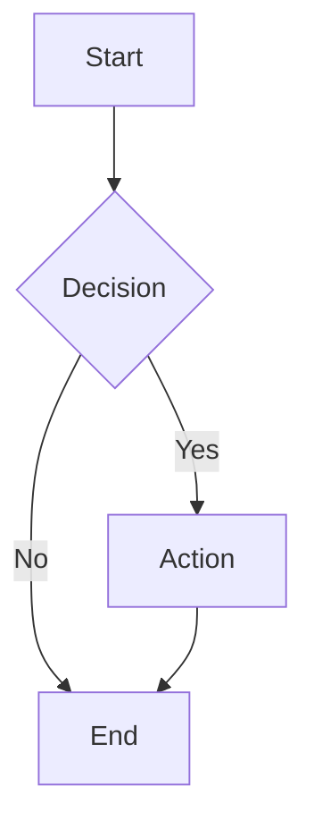
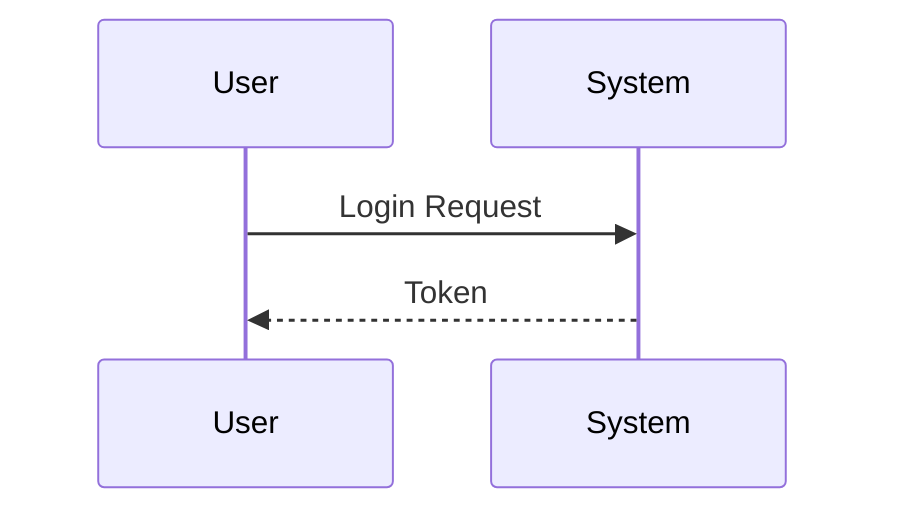
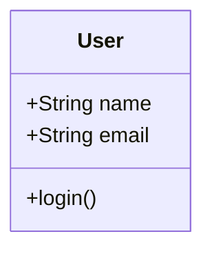
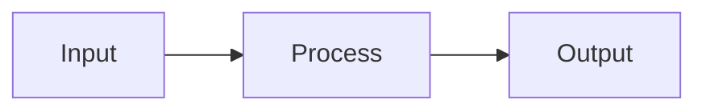

# Mermaid Rendering Test

Test the rendering by asking CodeNav to create diagrams!

## Test Queries

### 1. Simple Flowchart
Ask: "Show me a simple flowchart"

Expected output:


### 2. Sequence Diagram
Ask: "Create a sequence diagram for user login"

Expected output:


### 3. Class Diagram
Ask: "Draw a class diagram for a simple user system"

Expected output:


## Testing Instructions

1. **Reload VS Code Window** (Cmd/Ctrl + Shift + P → "Reload Window")
2. Open CodeNav sidebar
3. Ask: "Create a flowchart showing how authentication works"
4. The diagram should render automatically

## Debugging

If diagrams don't render:
1. Open Developer Tools (Help → Toggle Developer Tools)
2. Check Console for errors
3. Look for "Mermaid initialized" and "Marked initialized" messages

## Manual Test

Copy this into the chat and ask CodeNav to echo it:

```
Here's a test diagram:


```

The diagram should render as a visual flowchart, not as text.
